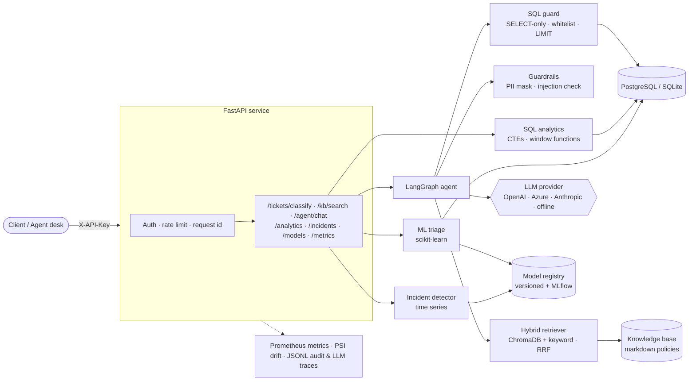
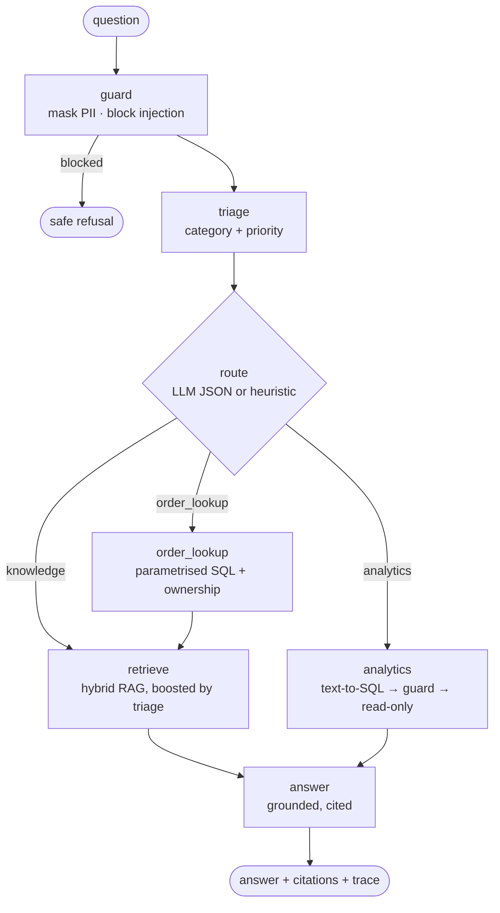

<div align="center">

# 🧭 Atlas — AI Support Copilot

**Production-style AI system for customer support: ML ticket triage · RAG over policies · LangGraph agent with safe text-to-SQL · incident detection on time series · SQL analytics — behind a secured FastAPI service.**

[](https://github.com/DaviCarvalhoo/atlas-ai/actions/workflows/ci.yml)


[🇧🇷 Resumo em português](#-resumo-em-português) · [Quickstart](#-quickstart) · [Architecture](#-architecture) · [Results](#-results) · [API](#-api)

</div>

---

## 📌 The business problem

**AtlasShop** (a fictional Brazilian e-commerce) receives ~10k support tickets a year. Agents waste time on
three things: **routing** tickets to the right queue, **searching** policies to answer customers, and
**looking up** order data in other systems. Incidents (a payment-gateway outage, a carrier strike) are only
noticed hours later, when the queue has already exploded.

Atlas turns that into **measurable** outcomes:

| Need | Solution | KPI (held-out / golden set) |
|---|---|---|
| Route tickets automatically | TF-IDF + Logistic Regression classifier (category & priority) | **macro-F1 0.94**, 97.5% auto-routed at **96.1%** accuracy |
| Never miss an urgent ticket | Priority model with tier/channel features | **urgent recall 0.89** |
| Answer policy questions with sources | Hybrid RAG (dense + keyword, RRF) boosted by the ML triage | **hit@3 = 1.00**, MRR 0.95 |
| "Where is my order?" | Agent tool: parametrised, ownership-checked SQL | 100% routing accuracy |
| Analysts ask questions in natural language | Schema-grounded, **self-correcting** text-to-SQL behind a SQL guard + read-only transaction | 22/22 red-team cases blocked/passed |
| Grounded answers | LLM answers only from retrieved context, with citations | key fact present in **96.9%** of answers (Groq `gpt-oss-120b`) |
| Detect incidents early | Seasonal robust-z vs IsolationForest (champion/challenger) | **F1 0.84**, precision 0.89 |
| Protect customer data (LGPD) | PII masking before any model, log or LLM call; hashed audit trail | 0 raw PII in logs (tested) |

> Everything runs **with zero API keys** (deterministic offline mode) so any reviewer can reproduce it in one
> command — and switches to **OpenAI, Azure OpenAI, Anthropic Claude, xAI Grok or Groq (open-weight models such as
> `gpt-oss-120b`)** with one environment variable.

---

## 🏗 Architecture



### The agent (LangGraph state machine)



Each node is a small, testable method with injected dependencies. With a real LLM, routing, text-to-SQL and
generation are model-driven. If the LLM call fails, the agent falls back to the deterministic heuristics instead
of failing the request.

---

## ✨ What's inside

<table>
<tr><td width="50%" valign="top">

**🤖 Machine Learning (scikit-learn, pandas, NumPy)**
- Seeded synthetic dataset with realistic properties: label noise, ambiguous messages, weekly seasonality, carrier-specific delays and labelled incident days
- **Model selection** with 5-fold stratified CV (dummy → Complement NB → Logistic Regression)
- **Out-of-time split** (train on the past, test on the most recent 20%) to avoid leakage
- Confidence threshold → **auto-route vs. human triage**
- Incident detection on daily volume: weekday-adjusted **robust z-scores** vs **IsolationForest**, compared champion/challenger style

</td><td width="50%" valign="top">

**🧠 LLMs, RAG & Agents**
- Provider-agnostic layer: **OpenAI, Azure OpenAI, Anthropic (Claude), xAI (Grok), Groq (open-weight models)** + offline mode
- Retries with backoff, latency/token accounting, **JSONL tracing**, versioned prompts
- Structure-aware chunking + **pluggable embeddings** (LSA offline · sentence-transformers · OpenAI)
- **ChromaDB** vector store + char-n-gram keyword index fused with **Reciprocal Rank Fusion**
- **Metadata-aware retrieval**: the ML-predicted category boosts the relevant documents
- **LangGraph** agent with guardrails, tools and citations

</td></tr>
<tr><td valign="top">

**🗄 SQL & data**
- Normalised schema (SQLite locally, **PostgreSQL** in Docker) via SQLAlchemy
- Analytical queries with **CTEs, window functions (`RANK`, `LAG`, `SUM() OVER`)**, CASE-based SLA logic
- Data-quality checks before loading; [EDA report](docs/eda.md) over structured + unstructured data

</td><td valign="top">

**🔐 Security, privacy & governance**
- PII masking (CPF, CNPJ, e-mail, phone, card) **before** training, retrieval, logs and LLMs
- Prompt-injection heuristics (PT/EN), input limits, API key + rate limiting
- Text-to-SQL: SELECT-only, table whitelist (PII table excluded, safe view instead), forced LIMIT, read-only transaction
- Order lookups enforce **customer ownership**; audit log stores only hashes

</td></tr>
<tr><td valign="top">

**⚙️ MLOps / LLMOps**
- **MLflow** experiment tracking (params, CV metrics, nested candidate runs, artifacts)
- File-based **model registry** with versions, metadata, data fingerprint, git SHA and a `production` alias
- **PSI drift monitor** on live predictions vs. the training distribution
- Prometheus `/metrics`, `/health`, `/ready`

</td><td valign="top">

**🧪 Quality**
- **52 tests**: unit, integration, API, the online-LLM code path (scripted fake LLM), SQL self-repair and provider-outage fallback
- Golden sets for retrieval (32 Qs) and agent routing (18 Qs) + a **red-team suite** (22 cases)
- **Quality gates** in CI: the build fails if any metric regresses below its threshold
- Ruff lint/format, GitHub Actions, Docker build

</td></tr>
</table>

---

## 🚀 Quickstart

### Option A — Docker (API + PostgreSQL + MLflow UI)

```bash
git clone git@github.com:DaviCarvalhoo/atlas-ai.git && cd atlas-ai
docker compose up --build
```

On first start the container **bootstraps itself**: it generates the data, loads it into Postgres, trains and registers the models, indexes the knowledge base and runs the evaluation.

| Service | URL |
|---|---|
| API docs (Swagger) | http://localhost:8000/docs |
| MLflow UI | http://localhost:5000 |

### Option B — Local (Python 3.11+)

```bash
python -m venv .venv && source .venv/bin/activate   # Windows: .venv\Scripts\activate
pip install -e ".[dev]"

atlas bootstrap          # build-db → train → index → evaluate (with quality gates)
atlas ask "Meu pedido 10234 está atrasado, o que faço?"
atlas serve              # http://localhost:8000/docs
pytest                   # 52 tests
```

### Use a real LLM

```bash
cp .env.example .env
# then set one of:
ATLAS_LLM_PROVIDER=anthropic   ANTHROPIC_API_KEY=...     # default model: claude-opus-5-5
ATLAS_LLM_PROVIDER=openai      OPENAI_API_KEY=...
ATLAS_LLM_PROVIDER=azure       AZURE_OPENAI_API_KEY=...  AZURE_OPENAI_ENDPOINT=...  ATLAS_AZURE_DEPLOYMENT=...
ATLAS_LLM_PROVIDER=xai         XAI_API_KEY=...           # Grok, via OpenAI-compatible endpoint
ATLAS_LLM_PROVIDER=groq        GROQ_API_KEY=...          # open-weight models (default: openai/gpt-oss-120b)

# optional: neural embeddings (better semantic retrieval)
pip install -e ".[local-embeddings]"  &&  ATLAS_EMBEDDING_PROVIDER=sentence-transformers atlas index
```

If a provider is selected but its credentials are missing, Atlas logs a warning and **falls back to offline
mode** instead of crashing.

---

## 📊 Results

All numbers below are reproducible with `atlas bootstrap` (seed 42) and are written to `artifacts/reports/`.

### Ticket triage (out-of-time test set, n = 1,981)

| Model | CV macro-F1 (5-fold) |
|---|---|
| Dummy (most frequent) | 0.092 |
| TF-IDF (word + char) + Complement NB | 0.934 |
| **TF-IDF (word + char) + Logistic Regression** ✅ | **0.935** |

| Task | Accuracy | Macro-F1 | Notes |
|---|---|---|---|
| Category (5 classes) | 0.943 | **0.941** | per-class F1 0.92–0.95; 97.5% of tickets auto-routed with 96.1% accuracy |
| Priority (4 classes) | 0.577 | 0.608 | **urgent recall 0.89**. Priority is intrinsically noisy (it depends on context that isn't in the text), so the model is tuned not to miss urgent tickets. |

### Retrieval (golden set, 32 paraphrased questions)

| Mode | hit@1 | hit@3 | MRR |
|---|---|---|---|
| Keyword (char n-grams) | 0.875 | 0.969 | 0.928 |
| Dense (LSA, offline) | 0.844 | 0.969 | 0.914 |
| Hybrid (RRF) | 0.875 | **1.000** | 0.932 |
| **Hybrid + triage boost** ✅ | **0.906** | **1.000** | **0.948** |
| _Dense (multilingual MiniLM, `sentence-transformers`)_ | _0.812_ | _0.969_ | _0.888_ |

> Small knowledge bases favour lexical signals; fusing them with dense vectors and the ML category prior gives
> the best ranking. The neural embedder matters more as the KB grows and questions get more paraphrased.

### Incident detection (365 days, 10 labelled incidents)

| Detector | Precision | Recall | F1 |
|---|---|---|---|
| **Seasonal robust z-score** ✅ champion | **0.889** | 0.80 | **0.842** |
| IsolationForest (challenger) | 0.545 | 0.60 | 0.571 |

> The simpler model won: incidents are spikes in *one* category, which a per-category z-score captures directly,
> while IsolationForest also flags multivariate oddities that aren't incidents. The pipeline promotes whichever
> detector scores best, so if a more complex model starts winning later it gets promoted automatically.

### Agent & safety

| Metric | Offline (no key) | LLM: Groq · `openai/gpt-oss-120b` |
|---|---|---|
| Routing accuracy (18 golden questions) | **1.00** (heuristics) | **1.00** (LLM router) |
| Answer contains the key fact (32 golden questions) | 0.875 (extractive) | **0.969** (generated, cited) |
| Red-team suite (injection, SQL attacks, PII) | **22 / 22** | **22 / 22** |

The LLM evaluation ran on Groq's free tier: it hit 104 rate-limit responses (429), and every one was recovered by the
rate-limit-aware backoff.

### Lessons from running against a real LLM

Testing with a real open-weight model surfaced failure modes that mocks never would. Each one is now fixed and
covered by a test:

| Failure | Symptom | Fix |
|---|---|---|
| **Wrong SQL dialect** | `INTERVAL '3 months'` (Postgres) sent to SQLite → syntax error | Prompt receives the live dialect and data range; DB errors are fed back to the model for **one self-repair attempt** |
| **Hallucinated enum value** | `status = 'canceled'` (data says `cancelled`) → *silently* returned **0** instead of **85** | Prompt is grounded with the exact allowed values per column |
| **Reasoning models burn the token budget** | `gpt-oss` spent all 500 tokens thinking → empty JSON → crashed the graph | Larger caps and **graceful degradation**: any LLM failure falls back to curated SQL / extractive answers |
| **Misleading fallback** | A failed query fell back to an *unrelated* template | Templates are used only when the provider is down, never to paper over a wrong query |
| **Typographic Unicode** | `24 horas`, `e‑mail`, `【1】` broke string matching (grounding looked like 0.50) | Output normalisation (NFKC + punctuation folding) before display and evaluation |

### Quality gates (CI fails below these)

`category_macro_f1 ≥ 0.85` · `urgent_recall ≥ 0.75` · `incident_f1 ≥ 0.70` · `retrieval_hit@3 ≥ 0.85` ·
`agent_routing_accuracy ≥ 0.85` · `answer_grounding ≥ 0.60` · `security_pass_rate = 1.0`

---

## 🔌 API

All `/v1/*` endpoints require the `X-API-Key` header.

| Method | Endpoint | Description |
|---|---|---|
| `POST` | `/v1/tickets/classify` | Category + priority + confidence + auto-route decision (PII masked) |
| `POST` | `/v1/tickets/classify/batch` | Up to 500 tickets per call |
| `POST` | `/v1/kb/search` | Hybrid / dense / keyword retrieval |
| `POST` | `/v1/agent/chat` | Agent answer with citations, SQL used, triage and execution trace |
| `GET` | `/v1/analytics` · `/v1/analytics/{name}` | Catalogue and execution of named SQL analytics |
| `GET` | `/v1/incidents?days=30` | Incident alerts with the driving category |
| `GET` | `/v1/models` | Registry metadata: version, metrics, data fingerprint, git SHA |
| `GET` | `/v1/monitoring/drift` | PSI between live predictions and the training distribution |
| `GET` | `/health` · `/ready` · `/metrics` | Liveness, readiness, Prometheus metrics |

```bash
curl -s localhost:8000/v1/agent/chat \
  -H "X-API-Key: change-me" -H "Content-Type: application/json" \
  -d '{"message": "Meu pedido 10234 está atrasado, o que faço? Meu CPF é 123.456.789-09"}'
```

```jsonc
{
  // offline mode shown; with an LLM provider the answer is generated from the same cited context
  "answer": "O pedido 10234 está **em transporte** (transportadora Jadlog, previsão 2025-09-15). Consultar o status do pedido e a data estimada de entrega. [2] Abrir uma reclamação com a transportadora (prazo de resposta de 3 dias úteis). [2]",
  "intent": "order_lookup",
  "citations": ["orders#10234", "prazos-e-entregas.md § Pedido atrasado", "..."],
  "triage": {"category": "shipping", "category_confidence": 0.78, "priority": "low", "auto_routed": true, "...": "..."},
  "pii_detected": {"CPF": 1},
  "trace": ["guard: pii={'CPF': 1} allowed=True", "triage: shipping/low (0.78)",
            "route: order_lookup (order_id=10234)", "order_lookup: found", "retrieve: [...]", "answer: done"]
}
```

```bash
# Natural-language analytics → guarded SQL (CTE + window function) → table
curl -s localhost:8000/v1/agent/chat -H "X-API-Key: change-me" -H "Content-Type: application/json" \
  -d '{"message": "Qual transportadora mais atrasa as entregas?"}'
```

---

## 🛡 Security & governance

| Risk | Control |
|---|---|
| Personal data reaching third-party LLMs | Regex PII masking (CPF, CNPJ, e-mail, phone, card) before any model call; the agent only sees `[CPF]`-style placeholders |
| PII in logs | Audit log stores a SHA-256 of the masked input, never the text; LLM traces store prompt hashes, tokens and latency only |
| Prompt injection | Pattern-based detection (PT/EN) at the graph entry; the answer prompt treats context as data, not instructions |
| SQL injection / data exfiltration via text-to-SQL | Single SELECT only, forbidden keywords, **table whitelist** (raw `customers` excluded → `v_customer_safe` view), forced `LIMIT`, executed in a **read-only transaction** |
| Broken access control | Order lookups are parametrised and filtered by `customer_id` when the caller is a customer |
| Abuse | API key auth + per-key rate limiting |
| Model refusals (Claude) | `stop_reason == "refusal"` handled; server-side fallback enabled |
| Silent model decay | PSI drift monitoring + versioned registry + quality gates in CI |

---

## 🗂 Project structure

```
atlas-ai/
├── src/atlas/
│   ├── config.py            # typed settings (pydantic-settings)
│   ├── db.py                # engine, schema, read-only queries
│   ├── analytics.py         # named SQL analytics
│   ├── data/                # synthetic data generator + quality checks
│   ├── ml/                  # classifiers, anomaly detection, training pipeline, registry, MLflow
│   ├── rag/                 # chunking, embeddings, ChromaDB, hybrid retriever
│   ├── llm/                 # OpenAI / Azure / Anthropic / offline providers, prompts
│   ├── agent/               # LangGraph graph + tools
│   ├── security/            # PII, SQL guard, guardrails, audit log
│   ├── monitoring/          # metrics, PSI drift
│   ├── eval/                # retrieval / agent / security evals, golden sets, quality gates
│   ├── api/                 # FastAPI app + schemas
│   └── cli.py               # `atlas` command
├── sql/                     # schema.sql, analytics.sql
├── knowledge_base/          # policy documents (RAG corpus, PT-BR)
├── tests/                   # 52 tests
├── scripts/eda.py           # exploratory analysis → docs/eda.md
├── docs/                    # design spec, EDA report
├── Dockerfile · docker-compose.yml · .github/workflows/ci.yml
```

---

## 🧩 Design decisions & trade-offs

- **Classical ML where it wins, LLMs where they add value.** Ticket triage is a high-volume, low-latency task.
  A linear TF-IDF model reaches 0.94 macro-F1 for a fraction of a millisecond and zero cost, and it's explainable.
  LLMs are used for what classical models can't do: reasoning over retrieved policies, generating answers and
  writing SQL.
- **The two connect.** The classifier's category is used as a retrieval prior, which raised hit@1 from 0.875 to 0.906.
- **Champion/challenger instead of a favourite algorithm.** The IsolationForest lost to a robust z-score, and the
  pipeline is built to accept that.
- **Offline-first reproducibility.** A reviewer, CI or a demo needs no keys, GPUs or model downloads.
- **Monolith with clean module boundaries.** It's simple to deploy, and the boundaries (`ml`, `rag`, `agent`, `api`)
  are where it would be split if needed.

## ⚠️ Limitations & next steps

- The data is **synthetic** (seeded and realistic, but not real customer behaviour). Next step: plug in real tickets via the same SQL schema.
- Golden sets are small (32 + 18 questions), and some retrieval settings were chosen on them. A larger,
  held-out set and **LLM-as-judge** grounding evaluation (faithfulness / answer relevance) would be the next step.
- The offline answer mode is extractive (0.875). With an LLM, grounding rises to 0.969. The metric is still a
  string-match proxy, and an LLM-as-judge would measure faithfulness more precisely.
- Production hardening: secrets manager, OAuth/JWT instead of a static key, Redis-backed rate limiting,
  OpenTelemetry/LangSmith tracing, MLflow Model Registry or Azure ML instead of the file registry, and scheduled
  retraining triggered by drift alerts.

---

## 🇧🇷 Resumo em português

**Atlas** é um copiloto de IA para atendimento ao cliente de um e-commerce brasileiro fictício, feito para
mostrar ponta a ponta como se leva IA a um problema real de negócio:

- **Machine Learning (Pandas, NumPy, Scikit-learn):**
  - Classificação de tickets por categoria e prioridade (macro-F1 de **0,94** e recall de **0,89** nos tickets urgentes).
  - Detecção de incidentes em **séries temporais** (F1 de **0,84**), com seleção champion/challenger.
- **LLMs:** a mesma interface atende **OpenAI, Azure OpenAI, Anthropic (Claude), xAI e Groq**. A Groq roda modelos open source, como o `gpt-oss-120b`. Há também um modo offline determinístico que roda sem chave.
- **Testado com LLM real:** a resposta contém o fato esperado em **96,9%** dos casos.
- **Text-to-SQL com autocorreção:** o prompt traz os valores válidos de cada coluna, e o erro do banco volta para o modelo corrigir a consulta.
- **RAG:** embeddings plugáveis, **ChromaDB** e busca híbrida (densa + palavras-chave, combinadas com RRF), com reforço pela categoria prevista pelo ML. Resultado: **hit@3 = 1,0**.
- **Agente LangGraph:** guardrails, consulta de pedidos com checagem de dono e text-to-SQL seguro.
- **SQL:** PostgreSQL/SQLite com CTEs e funções de janela.
- **API FastAPI:** autenticação, rate limit, métricas Prometheus, monitoramento de drift (PSI) e log de auditoria.
- **MLOps:** MLflow, registro de modelos versionado e quality gates no CI (GitHub Actions).
- **Infraestrutura:** Docker Compose com API, Postgres e MLflow UI.
- **Segurança e LGPD:**
  - Dados pessoais (CPF, e-mail, telefone, cartão) são mascarados antes de qualquer modelo, log ou LLM.
  - Proteção contra prompt injection e SQL injection, validada por uma suíte de red team (**22/22**).

Para rodar: `docker compose up --build` e abrir http://localhost:8000/docs.

---

<div align="center">

Built by **Davi Carvalho** · MIT License

</div>
